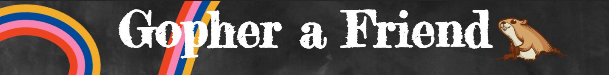

## Description
Gopher a Friend is a place for kids to discuss their interests with other kids that share those interests. An 8 year old kid who is obsessed with Uzbekistan is unlikely to find another kid that even knows that the country exists let alone wants to talk about it. Gopher a Friend is the place where that kid can find the 10 other kids spread across the country who are also enthralled with Uzbekistan and can talk about it and learn from each other. 

## Navigation
1. Click "Login"
2. Create a profile
3. Choose an interest
4. Create a post
5. To edit or delete a post click your user name above the post you want to edit and procced to change your post.
6. To ask a question click the chat box and you will be connected with one of the team.
7. To log out navigate back to your profile and click "Log out".

###Home
----

###Login
----

###Profile
----

###Geography
----

## Technology
* Node.js
* Express.js
* Handlebars.js
* MySQL
* JavaScript
* HTML
* CSS
* googlefonts
* www.onwebchat.com/

## Team
* <a href="https://github.com/madisenvo">Madisen Vogel</a>
* <a href="https://github.com/MMockus15">Marla Mockus</a>
* <a href="https://github.com/kelvinsinferno">Kelvin McDaniel</a>

## Repo
<a href="https://github.com/madisenvo/Gopher-a-Friend">Gopher a Friend</a>

## Site
<a href="https://gopher-a-friend.herokuapp.com/">https://gopher-a-friend.herokuapp.com/</a>

## Future
* Teacher created daily topics for their class
* Profile Gophers
* Resource Page
* Positive Affirmations
